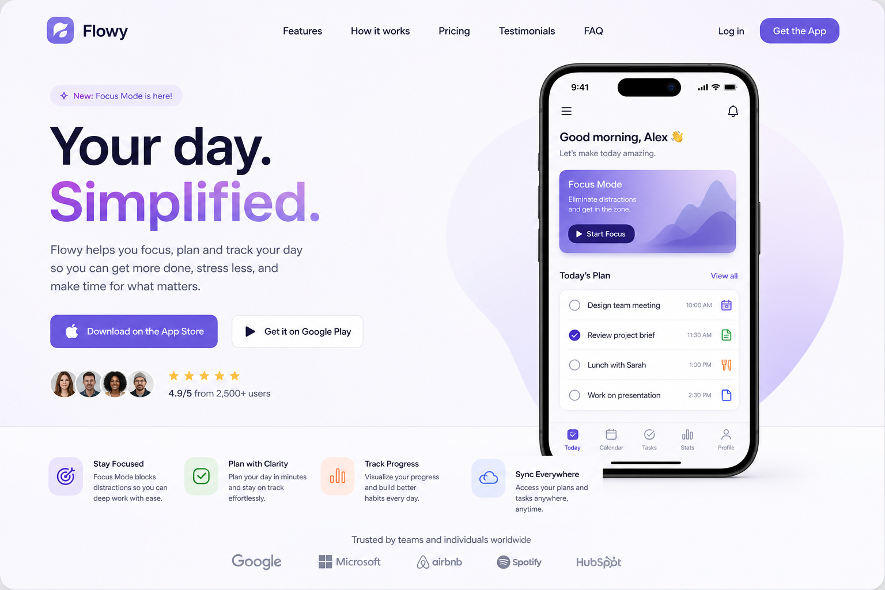
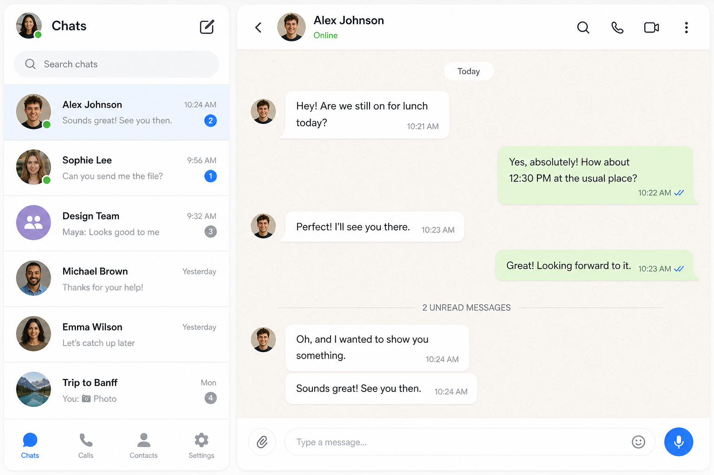
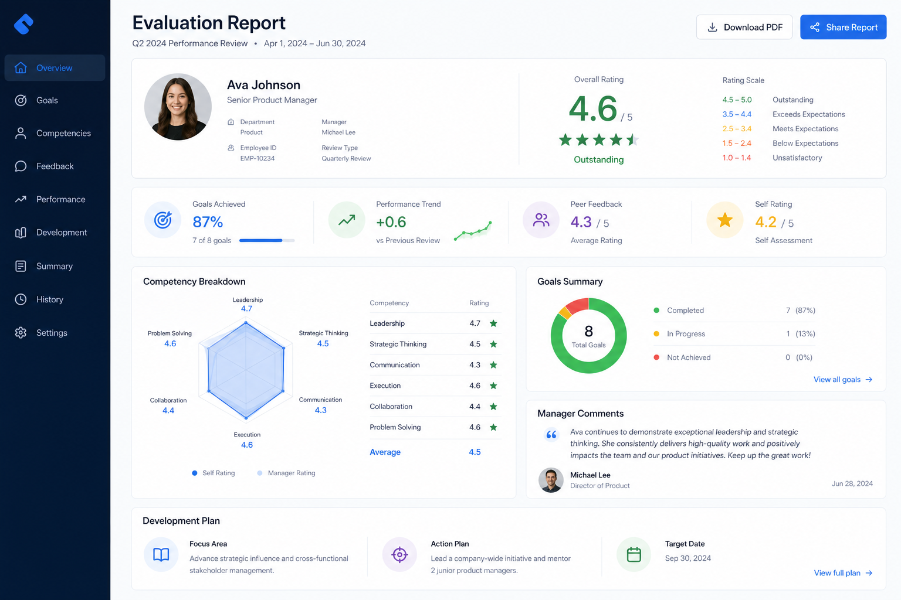

# English Coach AI

**Practice real-life English conversations. Get rubric-based feedback. Track your progress.**

English Coach AI is a scenario-based language learning web app. Learners choose everyday situations—ordering food, calling a school, checking into a hotel—and practice with an in-character AI partner. After each session, a four-dimension rubric scores performance and generates actionable feedback.

[](https://www.python.org/)
[](https://react.dev/)
[](https://fastapi.tiangolo.com/)

---

## Demo

| Landing | Conversation | Evaluation |
|---------|--------------|------------|
|  |  |  |

> **Tip:** Record a short screen capture while running the app locally and save it as `docs/images/demo.gif` to embed an animated demo in your fork.

---

## Why this project?

Most language apps drill flashcards. Real fluency means handling **situated conversations**: unclear questions, social norms, and task goals. This app:

- Simulates **7 real-world scenarios** (JSON-driven, easy to extend)
- Scores learners on **4 rubric dimensions** (1–5 scale)
- Works **without paid API keys** via a transcript-based heuristic evaluator
- Upgrades to **Claude** when `ANTHROPIC_API_KEY` is set

---

## Features

| Feature | Description |
|---------|-------------|
| **Scenario library** | Restaurant, school, doctor, landlord, bank, hotel, and more |
| **Chat practice** | iMessage-style UI, voice input, typing indicator |
| **Rubric evaluation** | Task completion, appropriateness, fluency, vocabulary |
| **Heuristic fallback** | Analyzes your transcript when no API key is configured |
| **Progress dashboard** | Line charts, streaks, personal bests |
| **Voice** | Web Speech API (input + TTS for AI replies) |

---

## Architecture

```
┌─────────────────────────────────────────────────────────────────┐
│                     React + Tailwind (Vite)                      │
│  Landing │ ScenarioSelector │ ConversationView │ EvaluationReport │
│  ProgressDashboard (Recharts)                                    │
└────────────────────────────┬────────────────────────────────────┘
                             │ REST /api → :8000
┌────────────────────────────▼────────────────────────────────────┐
│                      FastAPI Backend                             │
│  Sessions │ ScenarioController │ RubricEvaluator │ Feedback      │
│  Heuristic scoring (transcript analysis) │ Claude (optional)      │
│  SQLite via SQLAlchemy                                           │
└─────────────────────────────────────────────────────────────────┘
```

---

## Quick start

### Prerequisites

- **Python 3.11+**
- **Node.js 18+**
- *(Optional)* [Anthropic API key](https://console.anthropic.com/) for Claude-powered chat and evaluation

### 1. Clone and configure

```bash
git clone https://github.com/cgutierrez30/english-coach-ai.git
cd english-coach-ai
copy .env.example .env
```

Edit **`.env`** in the project root (not inside `backend/`):

```env
ANTHROPIC_API_KEY=sk-ant-...   # optional — app works without it
OPENAI_API_KEY=sk-...          # optional — Whisper only
DATABASE_URL=sqlite:///./dev.db
SECRET_KEY=change-me
```

Verify config: after starting the backend, open http://127.0.0.1:8000/health — `anthropic_configured` should be `true` if your key is set.

### 2. Backend

```bash
cd backend
python -m venv .venv

# Windows
.venv\Scripts\activate
# macOS / Linux
source .venv/bin/activate

pip install -r requirements.txt
uvicorn main:app --reload --port 8000
```

### 3. Frontend

```bash
cd frontend
npm install
npm run dev
```

Open **http://127.0.0.1:5173**

### 4. Run tests

```bash
cd backend
pytest -v
```

---

## Scenarios (7)

| Scenario | Difficulty | Est. time |
|----------|------------|-----------|
| Ordering food at a restaurant | Beginner | ~5 min |
| Calling your child's school | Intermediate | ~8 min |
| Scheduling a doctor's appointment | Intermediate | ~8 min |
| Asking a landlord about an apartment | Intermediate | ~8 min |
| Talking to a bank teller | Intermediate | ~8 min |
| Checking into a hotel | Beginner | ~5 min |

Add more by dropping JSON files into `backend/scenarios/library/` — no code changes required.

---

## Rubric (no API required)

When Claude is unavailable, the **heuristic evaluator** scores your transcript:

| Dimension | What it measures |
|-----------|------------------|
| **Task completion** | Keyword matching against scenario `goal_state` |
| **Communicative appropriateness** | Polite phrases (please, thank you, etc.) |
| **Fluency** | Words per turn, filler words, response length |
| **Vocabulary range** | Unique word count and lexical diversity |

Each dimension returns a **distinct score (1–5)** and a **specific justification** — not a flat 3/5 across the board.

---

## Project structure

```
english-coach-ai/
├── backend/          # FastAPI, rubric, scenarios, tests
├── frontend/         # React + Vite + Tailwind
├── docs/images/      # Screenshots for README
├── .env.example
├── CLAUDE.md         # Guide for AI agents / contributors
└── README.md
```

---

## Development workflow

```bash
# Backend with auto-reload
cd backend && uvicorn main:app --reload

# Frontend with API proxy
cd frontend && npm run dev

# Production build
cd frontend && npm run build
```

Commit in small, focused chunks — the project history is intentionally granular for review and grading.

---

## Roadmap

- [ ] User authentication
- [ ] PostgreSQL deployment
- [ ] Pronunciation scoring
- [ ] Teacher dashboard
- [ ] More scenarios (job interview, pharmacy, etc.)

---

## License

MIT — see repository for details.
